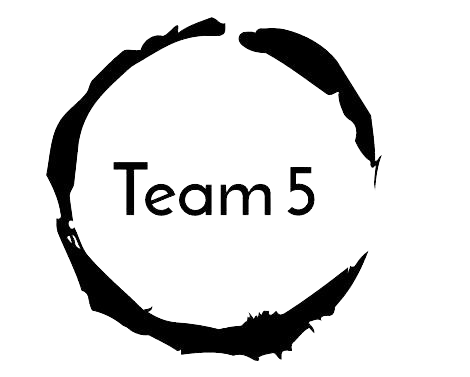

# React project



## App details

The goal of this Web App is to consume the RESTful API and present it nicely in a web application. The web app is responsive and viewable from any device (and screen size) with a modern browser. 

The application was created with `create-react-app`. 

The below 4 libraries were added:

- [Ant design](https://ant.design/) - for UI library/components
- [React Router](https://reactrouter.com/web/guides/quick-start) - for client-side (browser) routing
- [recharts](https://recharts.org/) - for building charts
- [axios](https://github.com/axios/axios) - for HTTP requests

## Run the app

```
npm install
npm start
open http://localhost:3000
```

## Learn More

- You can learn more in the [Create React App documentation](https://facebook.github.io/create-react-app/docs/getting-started).

- To learn React, check out the [React documentation](https://reactjs.org/).